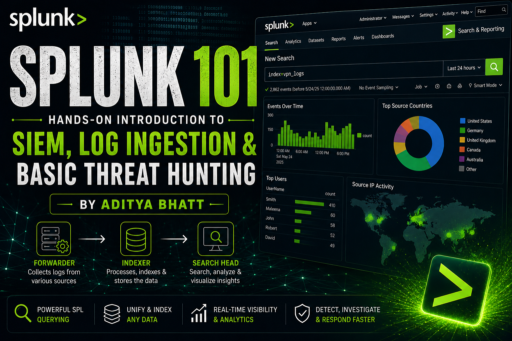
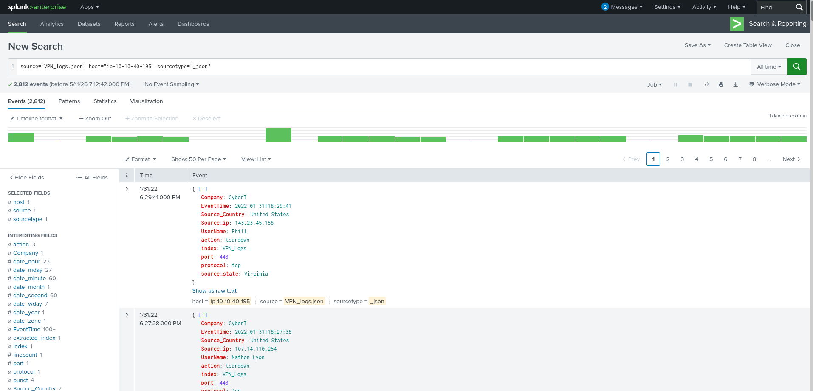
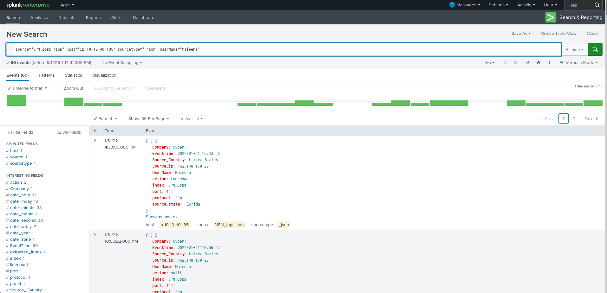
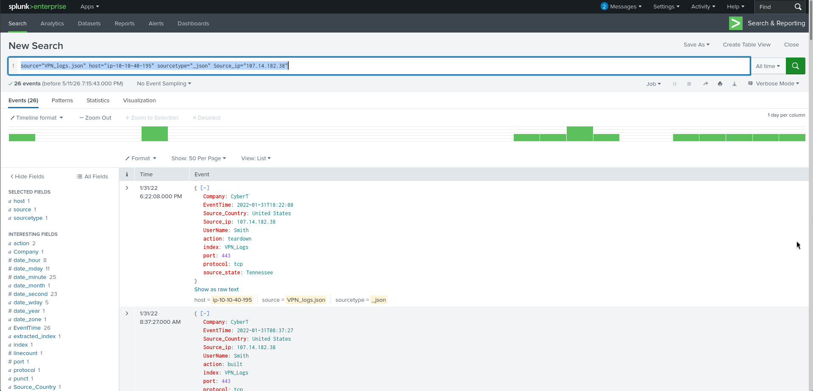
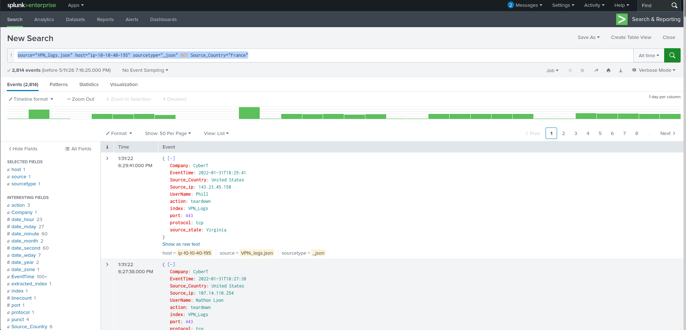
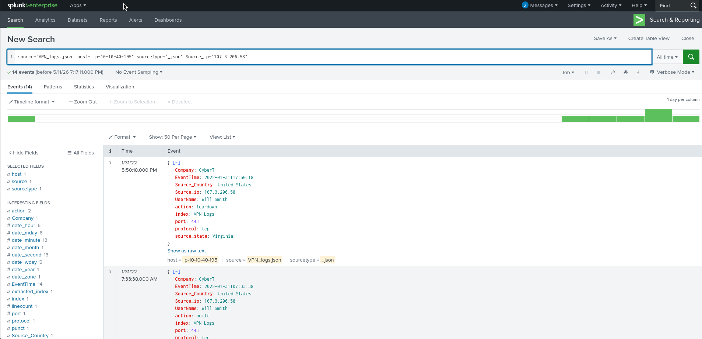

# Splunk 101: Hands-On Introduction to SIEM, Log Ingestion, and Basic Threat Hunting

**Keywords:** Splunk, SIEM, Log Analysis, SOC, Threat Hunting, TryHackMe

Security monitoring is not just about collecting logs—it’s about turning raw machine data into actionable security insights.

In this hands-on walkthrough, I explored the fundamentals of **Splunk**, one of the most widely used SIEM platforms, through a practical lab exercise involving log ingestion and basic investigation queries. Instead of only covering theory, this walkthrough focuses on *what we actually did, why we did it, and how Splunk helps security analysts investigate events efficiently.* 

**Lab Link:** [https://tryhackme.com/room/splunk101](https://tryhackme.com/room/splunk101)




---

# What is Splunk?

**Splunk** is a SIEM (Security Information and Event Management) platform that helps security teams:

* Collect logs from multiple sources
* Normalize and index machine data
* Search events efficiently
* Correlate security events
* Visualize trends and anomalies
* Accelerate incident detection and investigation

Think of it as a centralized visibility platform for your infrastructure.

Without SIEM tools, reviewing thousands of logs manually would be operationally painful.

---

# Core Splunk Architecture

Splunk mainly operates using three core components.

## 1. Forwarder

The **Forwarder** acts as the log collector.

It is a lightweight agent installed on monitored systems that gathers logs and forwards them to Splunk.

Typical data sources include:

* Windows Event Logs
* Syslogs
* Web server logs
* Firewall logs
* Database logs
* Endpoint telemetry

Its lightweight nature ensures minimal performance impact on the host.

**Answer from lab:** Forwarder

---

## 2. Indexer

The **Indexer** is where the real processing happens.

Once data reaches the indexer:

* Raw logs are parsed
* Data is normalized
* Fields are extracted
* Events are indexed for fast searchability

Without indexing, searching through millions of events would be painfully slow.

---

## 3. Search Head

The **Search Head** is the analyst’s workspace.

This is where:

* Queries are written
* Investigations are performed
* Dashboards are built
* Visualizations are generated

Splunk uses **SPL (Search Processing Language)** for querying indexed data.

---

# Connecting to the Lab

The lab environment provides a live Splunk instance.

After launching the machine, the dashboard becomes accessible via the provided IP.

At this point, the goal is not hunting threats yet—it’s simply getting familiar with the platform.

---

# Navigating the Splunk Interface

When opening Splunk for the first time, several interface sections appear.

## Top Navigation Bar

This provides administrative and operational controls:

* Messages
* Settings
* Activity
* Help
* Search
* App Switching

This is where analysts usually monitor running jobs and manage platform settings.

---

## Apps Panel

Splunk is modular.

Different apps provide specialized functionality.

The default app is:

**Search & Reporting**

This is the primary workspace for analysts.

---

## Explore Section

This section gives quick access to:

* Add Data
* Install Apps
* Documentation

This becomes especially useful during data onboarding.

---

# Adding Data into Splunk

A SIEM without data is just an expensive dashboard.

Splunk supports ingestion from:

* Event logs
* Syslogs
* Web logs
* Network telemetry
* Custom files
* API-based sources

For this lab, we worked with **VPN log data**.

---

# Collecting Data from Files

Inside **Add Data**, Splunk provides multiple ingestion methods.

The correct option for file-based collection is:

**Monitor**

Why?

Because this mode continuously watches files or ports and ingests incoming data automatically.

---

# Practical Log Ingestion

We uploaded the provided VPN log dataset.

Splunk ingestion follows a structured workflow:

## Step 1 — Select Source

Choose the log file.

This tells Splunk what raw data needs processing.

---

## Step 2 — Select Source Type

This defines how Splunk interprets the incoming data.

Examples:

* Syslog
* JSON
* CSV
* Windows logs

Choosing the correct type matters because field extraction depends on it.

---

## Step 3 — Input Settings

Here we configured:

* Index Name → `vpn_logs`
* Host metadata

The index acts like a searchable storage bucket.

---

## Step 4 — Review

Always validate configurations before ingestion.

Incorrect source parsing can break field extraction later.

---

## Step 5 — Done

Splunk processes the file and indexes the events.

Now the investigation phase begins.

---

# Investigation Queries

Now comes the fun part.

Instead of manually opening raw logs, we query structured event data.

---

# 1. Total Number of Events

Objective:

Determine how many events exist in the uploaded dataset.

### PAYLOAD

```spl
source="VPN_logs.json" host="ip-10-10-40-195" sourcetype="_json"
```

### Why this works

This tells Splunk:

> Search everything inside the `VPN_logs` index.

Since no filters are applied, Splunk returns all indexed events.

### Result

**2862 events**



---

# 2. Events Generated by User "Maleena"

Objective:

Identify all VPN activity associated with a specific user.

### PAYLOAD

```spl
source="VPN_logs.json" host="ip-10-10-40-195" sourcetype="_json" UserName="Maleena"
```

### Why this works

This query:

* Searches inside `vpn_logs`
* Filters only events where `UserName` equals `Maleena`

This is useful during user-centric investigations.

Examples:

* Insider threat reviews
* Suspicious account monitoring
* Login activity auditing

### Result

**60 events**



---

# 3. Identify Username Behind an IP Address

Objective:

Map an IP address back to a user identity.

### PAYLOAD

```spl
source="VPN_logs.json" host="ip-10-10-40-195" sourcetype="_json" Source_ip="107.14.182.38"
```

### Why this works

This filters events originating from the specified source IP.

This is common during incident response when an IP is flagged externally and analysts need attribution.

### Result

**Smith**



---

# 4. Events from All Countries Except France

Objective:

Exclude one geography from the search.

### PAYLOAD

```spl
source="VPN_logs.json" host="ip-10-10-40-195" sourcetype="_json" NOT Source_Country="France"
```

### Why this works

The `NOT` operator removes all events matching the specified condition.

This is useful when:

* Filtering known benign traffic
* Narrowing investigations
* Removing noise

### Result

**2814 events**



---

# 5. Activity from a Specific IP

Objective:

Check all events tied to a suspicious IP.

### PAYLOAD

```spl
source="VPN_logs.json" host="ip-10-10-40-195" sourcetype="_json" Source_ip="107.3.206.58"
```

### Why this works

This isolates activity from one host.

This helps in:

* IOC investigations
* VPN misuse analysis
* Threat actor tracking

### Result

**14 events**



---

# Key Splunk Concepts Learned

This exercise reinforces several foundational SIEM concepts:

### Log Ingestion

Security visibility starts with proper onboarding.

No data = no detection.

---

### Indexing

Raw logs become searchable events after parsing and indexing.

---

### SPL Querying

Analysts use SPL to rapidly hunt across large datasets.

---

### Filtering and Investigation

Instead of reading logs manually, we ask focused questions:

* Who logged in?
* From where?
* How often?
* Any anomalies?

---

# Why This Matters in Real SOC Work

Even though this is a beginner lab, the workflow mirrors real-world analyst activity.

A SOC analyst frequently:

* Investigates suspicious IPs
* Reviews user login activity
* Filters noise
* Hunts indicators of compromise
* Correlates events across datasets

Splunk dramatically reduces investigation time compared to manual log review.

---

# Final Thoughts

Splunk remains one of the most practical SIEM platforms for defenders because it combines:

* scalability
* fast search
* flexible parsing
* rich dashboards
* investigation speed

This lab was beginner-friendly, but it introduces the exact mindset needed for operational security monitoring.

Start with simple searches.

Then move toward:

* correlation rules
* alerting
* dashboards
* anomaly detection
* incident investigations

That’s where Splunk becomes truly powerful.

---

*Lab Reference: TryHackMe Splunk 101* 

---
